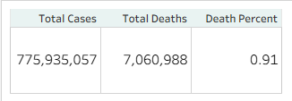
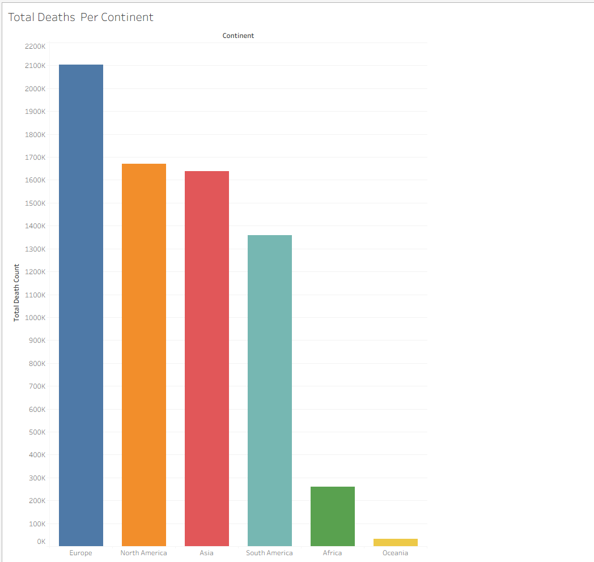
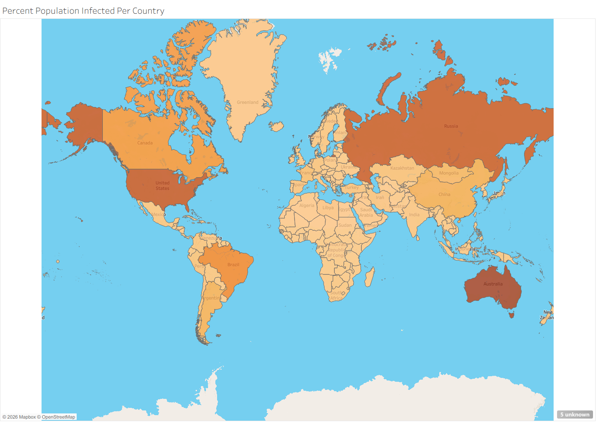
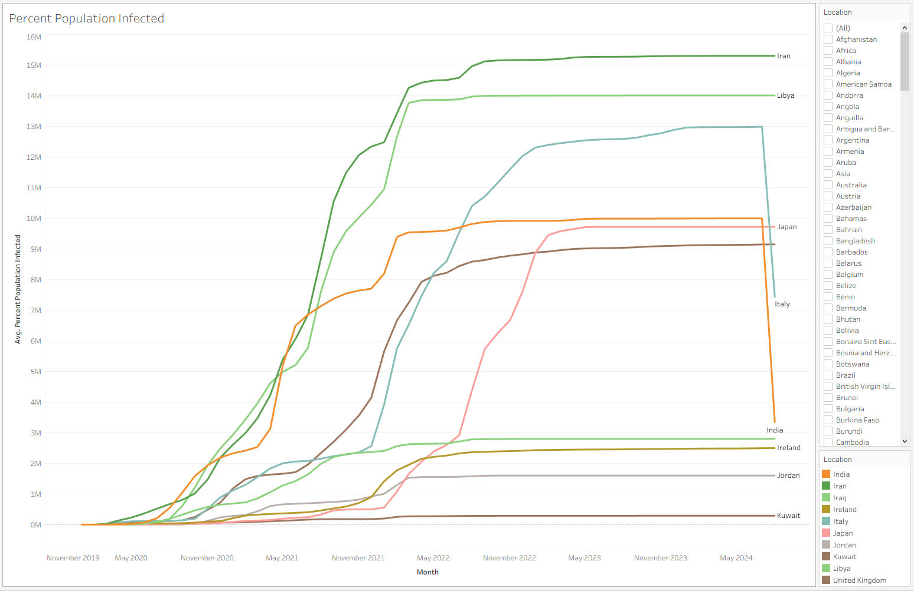

# 🦠 COVID-19 Data Exploration & Vaccination Analysis

Exploring the global pandemic through structured SQL analysis on real-world data, culminating in an interactive Tableau dashboard.

---

## 📌 Project Overview

This project analyzes the **Our World in Data** COVID-19 dataset — 67 columns of daily records across all countries, covering cases, deaths, hospitalizations, vaccinations, and demographics — to answer critical public health questions:

- How deadly is COVID-19 relative to confirmed infections (case fatality rate)?
- Which countries and continents suffered the highest death tolls?
- What share of each country's population was infected at its peak?
- How did vaccination rollout progress over time relative to population?

All queries were written and executed in **Google BigQuery (Standard SQL)**, with results exported to Tableau for visualization.

---

## 🗂️ Dataset Architecture

The original 67-column dataset was intentionally split into **two tables** following the principle of *Separation of Concerns* — each table has one clear subject, queries stay focused, and joins remain intentional.

### Table 1: `CovidDeaths`
Tracks the daily progression of the pandemic.

| Column Group | Columns |
|---|---|
| **Identifiers** | `iso_code`, `continent`, `location`, `date` |
| **Cases** | `total_cases`, `new_cases`, `new_cases_smoothed`, `*_per_million` variants |
| **Deaths** | `total_deaths`, `new_deaths`, `new_deaths_smoothed`, `*_per_million` variants |
| **Hospitalization** | `icu_patients`, `hosp_patients`, `weekly_icu_admissions`, `weekly_hosp_admissions`, `*_per_million` variants |
| **Demographics** | `population_density`, `reproduction_rate` |

> `population_density` is kept in `CovidDeaths` because it directly influences spread modeling and is always needed alongside cases/deaths.

### Table 2: `CovidVaccinations`
Tracks vaccination rollout across countries over time.

| Column Group | Columns |
|---|---|
| **Join Keys** | `iso_code`, `continent`, `location`, `date` |
| **Vaccinations** | `new_vaccinations`, `total_vaccinations`, `people_vaccinated`, `people_fully_vaccinated`, `total_boosters`, and `*_per_hundred` variants |

**Why split the data?**

| Reason | Explanation |
|--------|-------------|
| **Clarity** | Each table has a single, well-defined subject |
| **Performance** | Smaller tables = faster queries |
| **Join-ready design** | Both tables share `location + date` as join keys |
| **Real-world alignment** | Health and vaccination data come from separate sources in production |

**Primary Join Key:** `location + date`

---

## 🔍 Analysis Performed

### Part 1 — Deaths (`CovidDeaths`)

| Analysis | Description |
|---------|-------------|
| Death Percentage | `total_deaths / total_cases * 100` — likelihood of dying if infected, per country per day |
| Egypt Focus | Death percentage filtered specifically for Egypt |
| Infection Rate vs. Population | `total_cases / population_density * 100` — share of population that contracted COVID |
| Highest Infection Rate | Countries ranked by max infection rate relative to population |
| Highest Death Count | Countries with the most total deaths (country-level) |
| Continent Death Count | Continents ranked by total deaths |
| Daily Global Death % | Aggregated global new cases & deaths per day with daily CFR |
| Overall Global Summary | Single-row global totals: cases, deaths, death percentage |

### Part 2 — Vaccinations (`CovidDeaths JOIN CovidVaccinations`)

| Analysis | Description |
|---------|-------------|
| Basic Join | Both tables joined on `location + date` |
| Population vs. Vaccinations | Daily new vaccinations per country alongside population density |
| Rolling Vaccinations | Cumulative vaccination count using `SUM() OVER (PARTITION BY location ORDER BY date)` |
| CTE Approach | Rolling logic wrapped in a CTE (`PopvsVac`) for clean vaccination % calculation |
| Temp Table | Same logic stored in a `TEMP TABLE` for reuse within the session |
| View Creation | Final result stored as a BigQuery View (`percentPopulationVaccinated`) for Tableau ingestion |

---

## 🧠 Key SQL Techniques Used

| Technique | Purpose |
|-----------|---------|
| `SAFE_DIVIDE()` | Avoids division-by-zero without `CASE WHEN` |
| `CAST(... AS INT64)` | Handles columns stored as strings/floats |
| `SUM() OVER (PARTITION BY ... ORDER BY ...)` | Rolling cumulative window aggregations |
| `WITH ... AS (CTE)` | Modular, readable multi-step query structure |
| `CREATE TEMP TABLE` | Session-scoped reusable result sets |
| `CREATE VIEW` | Persistent reusable queries for visualization layers |
| `WHERE continent IS NOT NULL` | Filters out aggregated rows (World, continents, income groups) |

---

## 🏗️ Project Structure

```
📦 COVID-19-Data-Exploration-Vaccination-Analysis
│
├── README.md                        ← You are here
├── analytical_thinking.md           ← Thought process using Google's 6-phase framework
│
├── 1_deaths_exploration.sql         ← Cases, deaths, infection rates, global aggregates
├── 2_vaccinations_exploration.sql   ← JOIN + rolling vaccinations + CTE
├── 3_views_and_temp_tables.sql      ← Temp table + CREATE VIEW for visualization
└── covid_tableau_data_prep.sql      ← 4 final queries that feed the Tableau dashboard
│
├── CovidDeaths.csv                  ← Daily cases, deaths, hospitalization per country
├── CovidVaccination.csv             ← Daily vaccination rollout per country
│
└── tableau_exports/                 ← Excel exports from the 4 Tableau prep queries
    ├── 1_global_summary_metrics.xlsx
    ├── 2_total_deaths_by_location.xlsx
    ├── 3_infection_rate_by_location.xlsx
    └── 4_daily_infection_trend.xlsx
```

---

## 🛠️ Tools & Environment

| Tool | Usage |
|------|-------|
| **Google BigQuery** | SQL engine — all queries written and executed here |
| **Our World in Data** | Source dataset (67-column COVID-19 complete dataset) |
| **Tableau Public** | Interactive dashboard and visualization |
| **GitHub** | Version control and project showcase |

---

## 📊 Tableau Dashboard

🔗 **[View Interactive Dashboard on Tableau Public](https://public.tableau.com/app/profile/adham.eltantawi1075/viz/CovidDashboard_17760856542580/Dashboard1?publish=yes)**

The dashboard was built on **4 pre-aggregated query outputs** from `covid_tableau_data_prep.sql`:

| # | Query | Chart Type | Insight |
|---|-------|-----------|---------|
| 1 | `global_summary_metrics` | KPI scorecard | Global scale snapshot |
| 2 | `total_deaths_by_location` | Horizontal bar | Which continents suffered most |
| 3 | `infection_rate_by_location` | Choropleth map | Geographic spread by country |
| 4 | `daily_infection_trend` | Multi-line time-series | Country infection trajectory over time |

### Dashboard Preview

<!-- FULL DASHBOARD — replace path if needed -->


---

<!-- CHART 1 - replace with cropped screenshot -->
### 📌 Global Summary KPIs


---

<!-- CHART 2 - replace with cropped screenshot -->
### 📌 Total Deaths by Continent


---

<!-- CHART 3 - replace with cropped screenshot -->
### 📌 Percent Population Infected (World Map)


---

<!-- CHART 4 - replace with cropped screenshot -->
### 📌 Percent Population Infected Over Time


---

## 💡 Key Findings

- **Global case fatality rate** was approximately **~2.1%** of confirmed cases worldwide.
- **North America and South America** recorded the highest total death counts among continents.
- Smaller, densely-tested nations (San Marino, Andorra, Gibraltar) showed disproportionately high infection rates relative to their population size.
- **Vaccination rollouts** accelerated sharply in early-to-mid 2021, with high-income countries far ahead of low-income nations in coverage.
- Egypt's CFR consistently exceeded the global average during peak waves, suggesting strain on healthcare capacity or differences in testing rates.

---

## 📂 Dataset Source

- **Name:** COVID-19 Complete Dataset
- **Provider:** [Our World in Data](https://ourworldindata.org/covid-deaths)
- **Coverage:** All countries, full pandemic timeline
- **Columns:** 67 fields — cases, deaths, hospitalization, vaccinations, testing, demographics

---

## 👤 Author

**Adham Eltantawi** — Data Analyst  
📊 [Tableau Public Profile](https://public.tableau.com/app/profile/adham.eltantawi1075)

> *This project is part of a growing data portfolio focused on real-world datasets and reproducible SQL analysis.*
